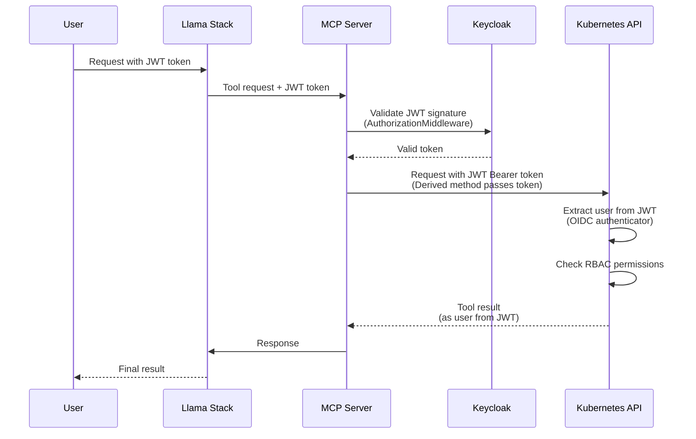
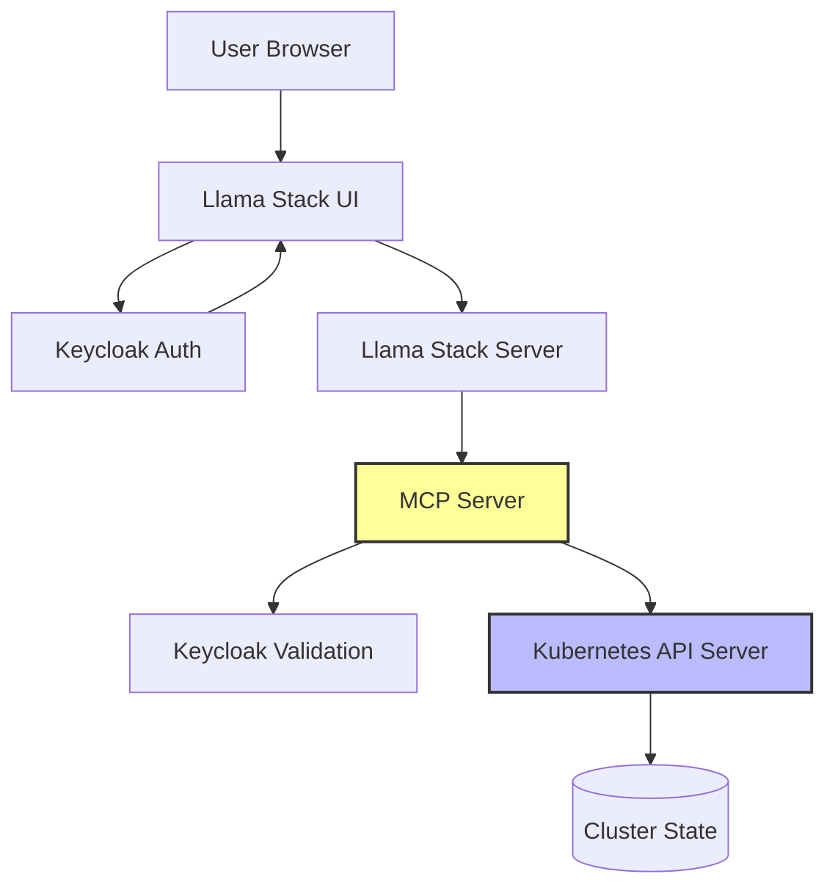

# Authentication Implementation in Llama Stack and MCP Server

This document outlines the high-level architecture for integrating JWT-based authentication in both Llama Stack and MCP server using Keycloak for secure Kubernetes operations.

## Overview

This architecture enables secure, user-authenticated operations on Kubernetes clusters through a unified authentication system. Users authenticate via Keycloak and receive JWT tokens that are validated and propagated through Llama Stack to the MCP server, which in turn uses these tokens to access Kubernetes resources with the user's identity.


## 1. System Components

- **Llama Stack**: Core AI service platform that receives user requests
- **MCP Server**: Kubernetes management layer that translates requests to K8s API calls (passes JWT tokens)
- **Keycloak**: Central identity provider for authentication
- **Kubernetes API**: Target cluster for operations (extracts user identity from JWT automatically)
- **OIDC Authenticator**: Kubernetes built-in authenticator that validates JWT tokens and extracts user identity

## 2. Authentication & Authorization Flow



**Note**: Kubernetes API server automatically extracts user identity from JWT claims (`sub` claim).

## 3. Key Architectural Components

### 3.1 JWT Token Structure

The JWT token contains critical information:
- **Header**: Algorithm (RS256) and token type
- **Payload**: 
  - `sub`: User identifier (e.g., "user:lance")
  - `groups`: Array of user groups (e.g., ["llama-developers"])
  - `aud`: Audience (MCP server client ID)
  - `iss`: Issuer (Keycloak realm URL)
- **Signature**: RSA signature for validation

### 3.2 MCP Server Configuration

The MCP server needs OIDC configuration to validate JWT tokens. Configure via environment variables:

```yaml
env:
  - name: OAUTH_ISSUER_URL
    value: "https://keycloak.example.com/auth/realms/llama-realm"
  - name: OAUTH_AUDIENCE
    value: "mcp-server"
  - name: REQUIRE_OAUTH
    value: "true"
```

## 4. Kubernetes OIDC Configuration (The Key Step!)

Configure Kubernetes API server to trust Keycloak as OIDC provider. This is the ONLY configuration needed!

**For OpenShift**:
```yaml
apiVersion: config.openshift.io/v1
kind: OAuth
metadata:
  name: cluster
spec:
  identityProviders:
    - name: keycloak
      mappingMethod: claim
      type: OpenID
      openID:
        clientID: kubernetes
        clientSecret:
          name: keycloak-client-secret
        claims:
          preferredUsername:
            - preferred_username
          groups:
            - groups
        issuer: https://keycloak.example.com/auth/realms/llama-realm
```

## 5. Security Controls

### 5.1 Token Validation
- **Signature Verification**: Validates JWT signature using Keycloak's public key
- **Audience Check**: Ensures token is intended for MCP server
- **Issuer Validation**: Verifies token came from trusted Keycloak realm
- **Expiration Check**: Rejects expired tokens
- **Leeway Window**: 5 seconds tolerance for clock skew

### 5.2 Kubernetes Native Authentication
- **RBAC Enforcement**: Kubernetes enforces RBAC based on `sub` (user) and `groups` claims
- **Namespace Restrictions**: Controlled via Kubernetes RoleBindings, not MCP server
- **Resource Permissions**: Controlled via Kubernetes RBAC, not MCP server

### 5.3 Audit Logging

All Kubernetes API calls are automatically logged with user identity from JWT:
```
2024-01-15 10:23:45 | USER: user:alice | ACTION: list pods | NAMESPACE: default | RESULT: success | TOKEN_ID: abc123def456
```

Kubernetes audit logs will show the authenticated user identity extracted from JWT claims.

## 6. Deployment Architecture




### Key Benefits

- ✅ **No Code Changes**: All components already support JWT authentication
- ✅ **Native Security**: Kubernetes handles user identity extraction
- ✅ **Unified Auth**: Single Keycloak realm for all components
- ✅ **Audit Trail**: Kubernetes logs all operations with user identity
- ✅ **RBAC Enforcement**: Standard Kubernetes RBAC based on JWT claims
