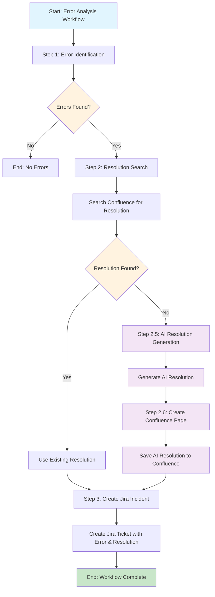
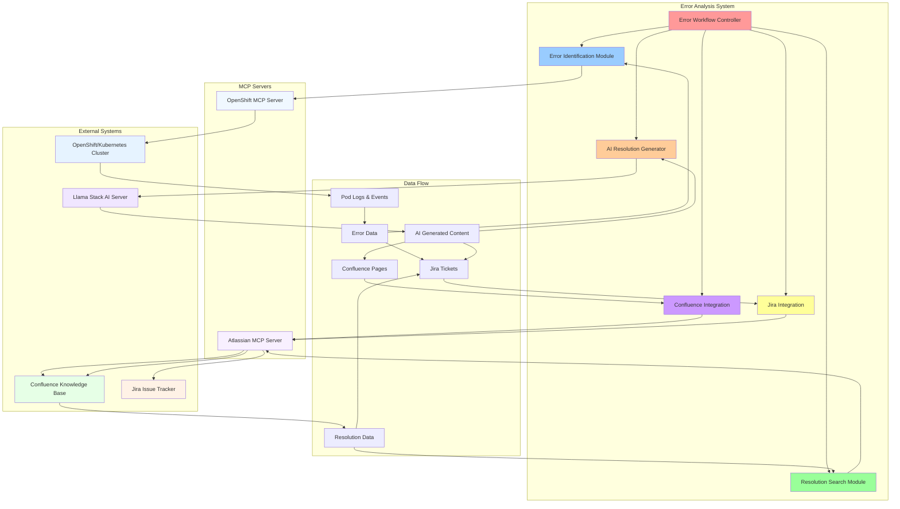
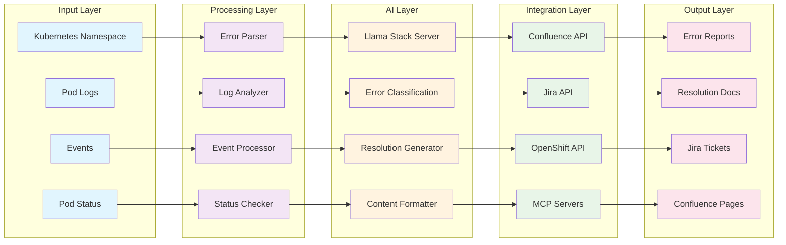

# Intelligent OpenShift Operations Agent

A comprehensive automated workflow that identifies errors in OpenShift/Kubernetes namespaces, searches for resolutions in Confluence, generates AI-powered solutions when needed, and creates Jira incidents for tracking.

## Overview

This workflow provides an intelligent error analysis system that:
- Automatically scans Kubernetes namespaces for errors
- Searches Confluence for existing resolution documentation
- Generates AI-powered resolutions when no documentation exists
- Creates Confluence pages for new resolutions
- Automatically creates Jira incidents for tracking

## Workflow Diagram



## System Architecture Block Diagram



## Component Block Diagram



## Features

### 🔍 **Error Identification**
- Scans all pods in specified namespace
- Analyzes pod logs for error patterns
- Checks Kubernetes events for warnings/errors
- Identifies failed, crashed, or unhealthy pods
- Extracts detailed error information with timestamps

### 📚 **Resolution Search**
- Searches Confluence knowledge base for existing resolutions
- Uses intelligent search queries based on error types
- Retrieves full page content for resolution details
- Supports multiple Confluence spaces

### 🤖 **AI Resolution Generation**
- Generates intelligent resolutions when no documentation exists
- Provides root cause analysis
- Suggests step-by-step fix procedures
- Includes verification steps
- Creates structured resolution documentation

### 📝 **Confluence Integration**
- Automatically creates new Confluence pages for AI-generated resolutions
- Uses proper Confluence markup formatting
- Includes timestamps and source information
- Maintains knowledge base consistency

### 🎫 **Jira Incident Management**
- Creates detailed Jira incidents for each error
- Includes error details, resolution steps, and references
- Supports custom project keys and issue types
- Tracks AI-generated vs. documented resolutions

## Prerequisites

### Required Tools
- Python 3.8+
- Access to OpenShift/Kubernetes cluster
- Confluence access with appropriate permissions
- Jira access with project creation rights
- Llama Stack server for AI processing

### Dependencies
```bash
pip install rich python-dotenv
```

### Configuration
Create a `config.env` file with the following variables:
```env
# Llama Stack Configuration
LLAMA_STACK_URL=http://localhost:8321
LLM_MODEL_ID=llama-4-scout-17b-16e-w4a16
TEMPERATURE=0.3
MAX_TOKENS=2000

# Confluence Configuration
CONFLUENCE_URL=https://your-confluence-instance.com
CONFLUENCE_USERNAME=your-username
CONFLUENCE_API_TOKEN=your-api-token

# Jira Configuration
JIRA_URL=https://your-jira-instance.com
JIRA_USERNAME=your-username
JIRA_API_TOKEN=your-api-token
```

## Installation

1. **Clone the repository**
   ```bash
   git clone <repository-url>
   cd Intelligent_operations_agent
   ```

2. **Install dependencies**
   ```bash
   pip install -r requirements.txt
   ```

3. **Configure environment**
   ```bash
   cp config.env.example config.env
   # Edit config.env with your settings
   ```

4. **Set up MCP servers**
   - Ensure OpenShift MCP server is running
   - Ensure Atlassian MCP server is running
   - Verify connections in `react_agent_helper.py`

## Usage

### Basic Usage

```python
from error_workflow import intelligent_openshift_operations_workflow

# Run workflow for a specific namespace
result = intelligent_openshift_operations_workflow(
    namespace="my-namespace",
    project_key="KAN",
    space_key="ocp"
)

# Display results
from error_workflow import display_workflow_summary
display_workflow_summary(result)
```

### Command Line Usage

```bash
python error_workflow.py
```

### Advanced Configuration

```python
# Custom project and space settings
result = intelligent_openshift_operations_workflow(
    namespace="production",
    project_key="PROD",  # Jira project key
    space_key="production-docs"  # Confluence space
)
```

## Workflow Steps

### Step 1: Error Identification
- **Input**: Kubernetes namespace
- **Process**: 
  - Lists all pods in namespace
  - Checks pod status and health
  - Retrieves pod logs for error analysis
  - Examines Kubernetes events
- **Output**: Structured error data with details

### Step 2: Resolution Search
- **Input**: Error type from Step 1
- **Process**:
  - Searches Confluence for matching pages
  - Retrieves full page content
  - Extracts resolution information
- **Output**: Resolution data or "not found"

### Step 2.5: AI Resolution Generation (if no resolution found)
- **Input**: Error details from Step 1
- **Process**:
  - Generates root cause analysis
  - Creates step-by-step fix procedures
  - Provides verification steps
- **Output**: AI-generated resolution data

### Step 2.6: Confluence Page Creation (for AI resolutions)
- **Input**: AI-generated resolution data
- **Process**:
  - Creates new Confluence page
  - Formats content with proper markup
  - Includes metadata and timestamps
- **Output**: Confluence page URL

### Step 3: Jira Incident Creation
- **Input**: Error details + resolution data
- **Process**:
  - Creates Jira incident ticket
  - Includes error description and resolution
  - Sets appropriate priority and labels
- **Output**: Jira ticket key

## Error Types Detected

The workflow can identify and handle various error types:

- **Container Errors**: Image pull failures, container crashes
- **Resource Issues**: OOMKilled, resource limits exceeded
- **Network Problems**: Connection failures, DNS issues
- **Storage Issues**: Volume mount failures, disk space
- **Configuration Errors**: Invalid configs, missing secrets
- **Application Errors**: Runtime exceptions, service failures

## Output Examples

### Workflow Summary
```
┌─────────────────────────────────┐
│        Workflow Summary         │
├─────────────────┬───────────────┤
│ Namespace       │ my-namespace  │
│ Errors Processed│ 3             │
│ Jira Tickets    │ 3             │
│ AI Resolutions  │ 1             │
│ Confluence Pages│ 1             │
└─────────────────┴───────────────┘
```

### Error Data Structure
```json
{
  "namespace": "my-namespace",
  "errors_found": true,
  "error_count": 2,
  "errors": [
    {
      "pod_name": "app-pod-123",
      "error_type": "Container Crash",
      "error_timestamp": "2024-01-15T10:30:00Z",
      "error_description": "Container exited with code 1",
      "pod_status": "CrashLoopBackOff",
      "relevant_logs": "Error: Database connection failed..."
    }
  ]
}
```

## Troubleshooting

### Common Issues

1. **MCP Server Connection Failed**
   - Verify MCP servers are running
   - Check network connectivity
   - Validate authentication credentials

2. **Confluence Search Returns No Results**
   - Verify space key is correct
   - Check user permissions
   - Ensure search terms are appropriate

3. **Jira Ticket Creation Failed**
   - Verify project key exists
   - Check user permissions
   - Validate issue type configuration

4. **AI Resolution Generation Failed**
   - Verify Llama Stack server is running
   - Check model availability
   - Validate API configuration

### Debug Mode

Enable debug logging by setting:
```python
import logging
logging.basicConfig(level=logging.DEBUG)
```

## Contributing

1. Fork the repository
2. Create a feature branch
3. Make your changes
4. Add tests if applicable
5. Submit a pull request

## License

This project is licensed under the MIT License - see the LICENSE file for details.

## Support

For issues and questions:
- Create an issue in the repository
- Contact the development team
- Check the troubleshooting section

## Changelog

### Version 1.0.0
- Initial release
- Basic error identification workflow
- Confluence and Jira integration
- AI resolution generation
- Comprehensive documentation
